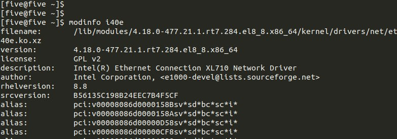
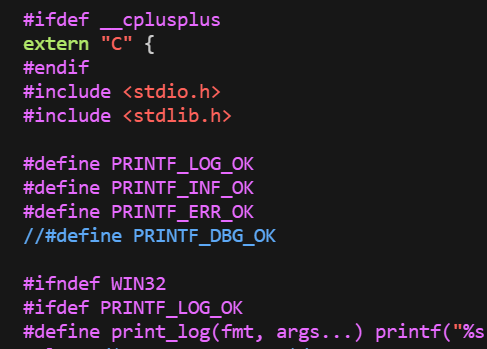
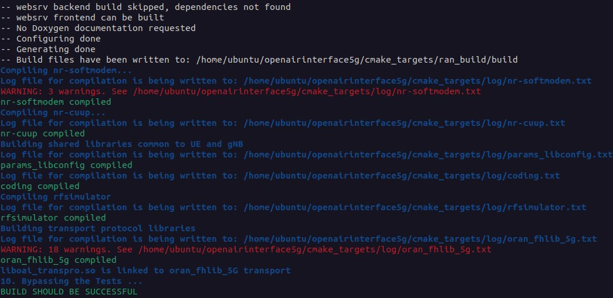

<table style="border-collapse: collapse; border: none;">
  <tr style="border-collapse: collapse; border: none;">
    <td style="border-collapse: collapse; border: none;">
      <a href="http://ngkore.com/">
         
         </img>
      </a>
    </td>
    <td style="border-collapse: collapse; border: none; vertical-align: center;">
      <b><font size = "5">Liteon-OAI 7.2 5G SA Tutorial (use_msgq branch) </font></b>
    </td>
  </tr>
</table>

**Table of Contents**
1. [Prerequisites](#1-prerequisites)
  - 1.1 [DPDK(Data Plane Development Kit) 20.05](#11-dpdkdata-plane-development-kit-2005)
  - 1.2 [Grub Configuration update](#12-grub-configuration-update)
  - 1.3 [OSC-PHY installation](#13-osc-phy-installation)
2. [Build OAI gNB](#2-build-oai-gnb)
3. [Linux PTP installation](#3-linux-ptp-installation)
4. [SCTP](#4-sctp)
5. [Bind Devices](#5-bind-devices)
6. [Configure server and OAI gnb](#6-configure-server-and-oai-gnb)
7. [5G Core Deployment](#7-5g-core-deployment)
8. [Run OAI gNB](#8-run-oai-gnb)


# 1. Prerequisites
The hardware on which we have tried this tutorial:


|Hardware (CPU,RAM)                          |Operating System (kernel)                  |NIC (Vendor,Driver)                     | Server Number |
|--------------------------------------------|----------------------------------|-------------------------------------------------|------|
| Intel(R) Xeon(R) Gold 6148, 80-Core, 128GB | RHEL 8.7 (with rtk installed) | Intel X710 for 10GbE SFP+,i40e | server 3 |


**NOTE**: These are not minimum hardware requirements. This is the configuration of our servers. The NIC card should support hardware PTP time stamping.

`Successful with only x710 NIC till now`

* Install the real time kernel after the fresh OS installation.
* After the reboot checkout the kernel version using following commands:
```bash
uname -r
```
Change the boot order, if rtk does open by default: Use the following command for that:
```bash
sudo grub2-set-default 0
```

* Check the OS version:
```bash
cat /etc/os-release
```

```bash
sudo yum update -y
```
These will update the packages and also change the os-version to 8.8
and now check once again using the `cat /etc/os-release` command: It will say `rhel 8.8`.

* tuned-adm for real time
```bash
tuned-adm profile realtime
```
* Check the Network interface Card and interface name, in my case the interface that is being used is `ens1f0`
```bash
sudo lshw -c network -businfo
```
* Check the network-driver version and it's default driver is mandatory and no need to update the driver version:
```bash
ethtool -i ens1f0
```

```bash
modinfo i40e
```


* Install meson
```bash
sudo yum install python3-pip -y
sudo pip3 install meson==0.58.2
```

* Install ninja
```bash
sudo yum localinstall ./rhel-packages/ninja-build-1.8.2-1.el8.x86_64.rpm
```

* Install gcc & make
```bash
sudo yum install gcc gcc-c++ kernel-devel make
```

# 1.1 DPDK(Data Plane Development Kit) 20.05

```bash
git clone https://github.com/NgKore47/liteon-dpdk.git ~/dpdk-20.05
```
**Note**: Remove the already built file:

```bash
cd ~/dpdk-20.05
rm -rf build
rm -rf x86_64-native-linuxapp-gcc
```

Start the build
```bash
meson build
cd build
sudo ninja
sudo ninja install
```
```bash
sudo dnf install numactl
sudo dnf install numactl-devel
```

```bash
cd ..
make install T=x86_64-native-linuxapp-gcc
```

DPDK should be built successfully.

# 1.2 Grub Configuration update

```bash
sudo vim /etc/default/grub
```
And modify the `GRUB_CMDLINE_LINUX` part and make it like this

```bash
GRUB_CMDLINE_LINUX="crashkernel=auto resume=/dev/mapper/rhel-swap rd.lvm.lv=rhel/root rd.lvm.lv=rhel/swap rhgb quiet igb.max_vfs=2 intel_iommu=on iommu=pt intel_pstate=disable nosoftlockup tsc=nowatchdog mitigations=off cgroup_memory=1 cgroup_enable=memory mce=off idle=poll hugepagesz=1G hugepages=40 hugepagesz=2M hugepages=0 default_hugepagesz=1G selinux=0 enforcing=0 nmi_watchdog=0 softlockup_panic=0 audit=0 skew_tick=1 isolcpus=managed_irq,domain,0-2,8-15 nohz_full=0-2,8-15 rcu_nocbs=0-2,8-15 rcu_nocb_poll"
```

Now update the grub and reboot:
```bash
grub2-mkconfig -o /boot/grub2/grub.cfg
sudo reboot
```

After the reboot, check whether the real time kernel is opened or not.
```bash
uname -r
```

Now check whether 40 hugepages are created or not:
```bash
grep HugePages /proc/meminfo
```
* tuned-adm for real time
```bash
tuned-adm profile realtime
```

# 1.3 OSC-PHY installation

```bash
git clone https://github.com/NgKore47/liteon-phy.git ~/phy
```
**Note:** The oai patches for phy are already applid in this repo.
Remove the already built files:
```bash
cd ~/phy
rm -rf fhi_lib/lib/build
```

Modify the line 38 by commenting the line `#define PRINTF_DBG_OK` of the `fhi_lib/lib/src/xran_printf.h`

```
vim fhi_lib/lib/src/xran_printf.h

# change the line
//#define PRINTF_DBG_OK
```


Export the the path
```bash
cd fhi_lib/
export XRAN_LIB_DIR=~/phy/fhi_lib/lib/build
export XRAN_DIR=~/phy/fhi_lib
export RTE_SDK=~/dpdk-20.05
export RTE_TARGET=x86_64-native-linuxapp-gcc
export RTE_INCLUDE=${RTE_SDK}/${RTE_TARGET}/include
```

For making this permanent, add the above lines in the `~/.bashrc` file:
and then:
```bash
source ~/.bashrc
```

Build phy
```bash
./build.sh
```

Output will show something like this:
```
[AR] build/libxran.so
./build/libxran.so
GTEST_ROOT is not set. Unit tests are not compiled
"echo "GTEST_ROOT is not set. Unit tests are not compiled"" command exited with code 0.

```

# 2. Build OAI gNB

Install the following libraries for oai-build:

```bash
sudo yum install guile -y
sudo yum -y groupinstall "Development Tools"
sudo yum localinstall ./rhel-packages/gc-devel-7.6.4-3.el8.x86_64.rpm
sudo yum localinstall ./rhel-packages/guile-devel-2.0.14-7.el8.x86_64.rpm
sudo yum localinstall ./rhel-packages/libconfig-devel-1.5-9.el8.x86_64.rpm
sudo yum localinstall ./rhel-packages/pkgconf-pkg-config-1.4.2-1.el8.x86_64.rpm
sudo yum localinstall ./rhel-packages/blas-devel-3.8.0-8.el8.x86_64.rpm
sudo yum localinstall ./rhel-packages/lapack-devel-3.8.0-8.el8.x86_64.rpm
sudo yum install python27
```

Build OAI

```bash
cd Liteon-OAI/cmake_targets/
./build_oai  --gNB --ninja -t oran_fhlib_5g -I
```


Checkout the build libraries:
```bash
cd Liteon-OAI/cmake_targets/ran_build/build/
ls
cp ~/phy/fhi_lib/lib/build/libxran.so .
```

# 3. Linux PTP installation

For this tutorial we are using `Fibrolan Falcon-Rx` and its `19th & 20th port`.
**Note**: 19th is connected to Liteon-RU while 20th is connected to ens1f0 interface of OAI server.

```bash
git clone https://github.com/NgKore47/linuxptp.git
```
Build linuxptp:
```bash
cd linuxptp
sudo make install
```
Run `ptp4l` & `phc2sys` using linuxptp

```bash
sudo ./ptp4l -i ens1f0 -m -H -2 -s -f configs/new_liteon.cfg
```

Open a new terminal and run the command:
```bash
sudo ./phc2sys -w -m -s enp3s0f0 -R 8 -f configs/new_liteon.cfg
```

# 4. SCTP 

Follow the below steps or [checkout the reference](https://sysadmin.lk/setup-sctp-in-red-hat-centos-linux-8/)

```bash
yum install -y lksctp-tools lksctp-tools-devel lksctp-tools-doc
```
Add `sctp` to `/etc/modules-load.d/` to load sctp before systemd-sysctl.service during boot. Loading sctp before systemd-sysctl.service allows the sctp sysctl.conf settings to be effective

```
# cat /etc/modules-load.d/sctp.conf
sctp
```

sctp is blacklisted by default on installation. Comment out the blacklisting to enable sctp to be loaded.

```
# grep sctp /etc/modprobe.d/*
/etc/modprobe.d/sctp-blacklist.conf:#blacklist sctp
/etc/modprobe.d/sctp_diag-blacklist.conf:#blacklist sctp_diag
```

```bash
modprobe sctp
```

Check whether the module is loaded 
```bash
lsmod | grep sctp
```
Verify SCTP supported or not.

```bash
checksctp
```

# 5. Bind devices
**Note:** Same interface `ens1f0` will be used here.

Become super user: `sudo su`

```bash
echo "0" > /sys/class/net/ens1f0/device/sriov_numvfs
echo "2" > /sys/class/net/ens1f0/device/sriov_numvfs
sudo ip link set ens1f0 vf 0 mac 00:11:22:33:44:66 vlan 564 spoofchk off trust on 
sudo ip link set ens1f0 vf 1 mac 00:11:22:33:44:66 vlan 564 spoofchk off trust on
modprobe vfio_pci
exit
```

Check the PCI address of the virtual functions, in this case it is: `0000:18:02.0` & `0000:18:02.1`

```bash
sudo python3 /usr/local/bin/dpdk-devbind.py -s
sudo python3 /usr/local/bin/dpdk-devbind.py --bind vfio-pci 0000:18:02.0
sudo python3 /usr/local/bin/dpdk-devbind.py --bind vfio-pci 0000:18:02.1
```
# 6. Configure Server and OAI gNB

Modify the following things in conf.json file
* PCI address: Parameter dpdk_dev_up and dpdk_dev_cp: In this case it will be: `0000:18:02.0` & `0000:18:02.1`
* DU Mac-address: Parameter o_du_macaddr: In this case it will be: `00:11:22:33:44:66`.
* RU MAC Address: Parameter o_ru_macaddr: In this case it will be: `e8:c7:4f:1e:c7:3b`
* Check the vlan tag: In this case it will be: `564`

Also check the values are correct on `oran.fh.band78.fr1.273PRB.conf`. No need to change this file if you are deploying ran and core on the same server.

Copy the configurational file:
```bash
cd ~/Liteon-OAI/targets/PROJECTS/GENERIC-NR-5GC/CONF
cp conf.json ~/Liteon-OAI/cmake_targets/ran_build/build/
```
# 7. 5G Core deployment

For 5G core deployment refer this repo:
[Ngkore-CN5G](https://github.com/NgKore47/Ngkore-CN5G.git)

# 8. Run OAI gNB

```bash
cd ~/Liteon-OAI/cmake_targets/ran_build/build/
sudo ./nr-softmodem -O ../../../targets/PROJECTS/GENERIC-NR-5GC/CONF/oran.fh.band78.fr1.273PRB.conf --sa --reorder-thread-disable
```
